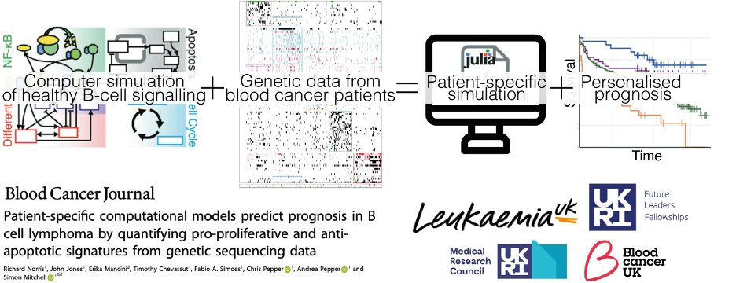

# Patient-specific modelling using mutational profiles

[](https://img.shields.io/github/v/release/navendu-pottekkat/awesome-readme?include_prereleases)
[](https://img.shields.io/github/last-commit/navendu-pottekkat/awesome-readme)
[](https://img.shields.io/badge/license-CC_BY_NC_SA-blue?link=https%3A%2F%2Fcreativecommons.org%2Flicenses%2Fby-nc-sa%2F4.0%2F)

The goal of this repository is to provide the quickest way to generate patient-specific modelling preditions as published in [Norris <i>et al.</i> 2024](https://mitchell.science/publication/patient-specific-computational-models-predict-prognosis-in-b-cell-lymphoma-by-quantifying-pro-proliferative-and-anti-apoptotic-signatures-from-genetic-sequencing-data/).

This should let you load in new datasets and ask new questions either in B-cell lymphoma or new diseases.
### Installation

This guide is only tested on Ubuntu but likely works on any unix-like operating system. 

<h3> Get the Docker Container Up and Running </h3>

1. **Get an OncoKB API access token.** 

    You will need to request an OncoKB API key in order to filter mutations by whether or not they are "likely oncogenic". You can do [that here](https://www.oncokb.org/api-access). Once you have the API token make a note of it because you will need it later.


> [!Note] 
> 
> Run steps 2-5 on the computational server you want to run the model from. Ideally a computer with lots of cores and RAM. The remaining steps can be run from any computer with network access to the web-interface (Jupyter Lab) that will be launched when we run the appropriate Docker image. 


2. **Create the right folders on your server**.

    Make a directory to work in, and a directory for model outputs to be saved in.
   ```sh
   mkdir patientModel
   cd patientModel
   mkdir outputs
   ```

3. **Clone this repo into your new folders.**
   ```sh
   git clone https://github.com/SiFTW/patientMutationModelling.git
   ```

4. **Download the Docker image** 

   Pull down the docker image you need, which has the model code included, and all Julia packages fixed at the version used in the publication.
   ```sh
   sudo docker pull siftw/norrisetal
   ```

5. **Run the Docker Image**

   Run the Docker image with the below command, which also mounts the folder containing the code you've just downloaded so that it is accessible within the Docker container..

   ```sh 
    sudo docker run --rm --group-add users -p 10005:8888 -e JUPYTER_ENABLE_LAB=yes -e JULIA_NUM_THREADS=64 -e NB_UID=1000 -e NB_USER=richard -e JUPYTER_TOKEN=letmein -v ~/patientModel/outputs:/multiscaleModel/SSDoutputs -v ~/patientModel/patientMutationModelling:/multiscaleModel/patientMutationModelling -e CHOWN_HOME=yes --user root -w /home/richard -e CHOWN_EXTRA_OPTS='-R' -w /multiscaleModel/ --user root -e CHOWN_EXTRA='/multiscaleModel/*,/multiscaleModel/' siftw/norrisetal:latest
    ```

   You may want to update the port above to an available one, and you may wish to uploade ```JULIA_NUM_THREADS``` to reflect the number of cores you wish Julia to be able to use.


> [!Note] 
> 
> Now you can switch to any computer/laptop that has access to the server (or continue on the server if you prefer). If you stay on the same server, you will want to use the 127.0.0.1 or localhost instead of a remote IP in the next step.

6. **Navigate to the Jupyter Lab web page**

    Open a web browser and enter the address and port of the Jupyter Lab instance that was launched by the running the Docker image.

    ```http://[IP address of server]:10005```

   Enter the jupyter login token you set above ("letmein" by default) into the login screen and you will load into Jupyter Lab.


  
7. **Move the contents of this repo to the root directory**

   Copy the three notebook files from the ```patientMutationModelling``` folder

   

   Past these files in the root directoy.


   

<h3> Filter Mutations Using OncoKB </h3>

8. **Add your OncoKB API token to the code**

    Open OncoKB_search.ipynb, and paste the OncoKB API token that you generated in Step 1 (above) into the place shown below (4th code block).

   

9. **Upload your list of single-nucleotide variants (SNVs) to the server**

   Drag and drop a CSV file named ```snvs.csv``` containing all your patient's mutational data into the root directory of the server's Jupyter Hub file explorer. At this point we just need every unique mutation in your dataset to make sure we can map all the important ones to parameters. Use the below file format:

   | SNV Name  | 
   | ------------- |
   | CREBBP:p.Y1450H  | 
   | KMT2D:p.Q3759*  | 
   | BCL10:p.L209*  |
   | MYD88:p.L265P  | 

10. **Query every mutation in OncoKB**

    Run the entire OncoKB_search.ipynb. Either press shift+enter after selecting the first cell, or use the Run menu and select Run All Cells. 

    

    This will create a file called ```annotatedSNVs.csv```.

11. **What is next...**

# License
[(Back to top)](#table-of-contents)

[Attribution-NonCommercial-ShareAlike 4.0 International](./LICENSE.txt)


